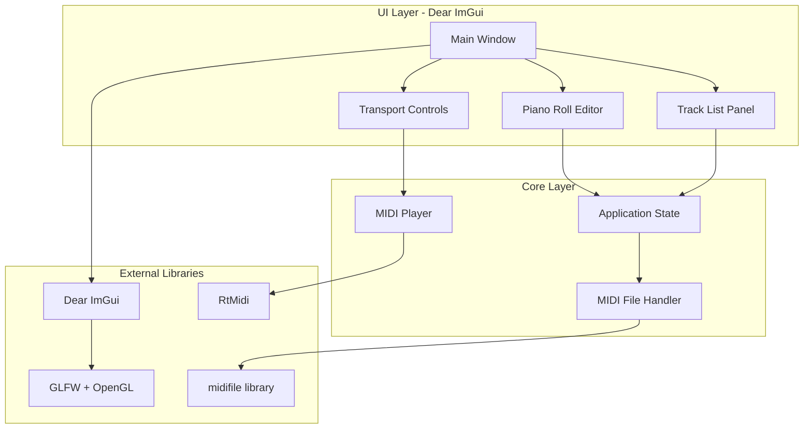

# MIDI Editor Application

## Architecture Overview




## Project Structure

```
midi/
├── CMakeLists.txt
├── README.md
├── src/
│   ├── main.cpp                  # Entry point, GLFW/ImGui setup
│   ├── app.h/cpp                 # Application state, project management
│   ├── midi/
│   │   ├── types.h               # Note, Track, Project structs
│   │   ├── midi_file.h/cpp       # Load/save MIDI files
│   │   ├── midi_player.h/cpp     # Playback with RtMidi
│   │   └── general_midi.h        # GM instrument names (128)
│   └── ui/
│       ├── main_window.h/cpp     # Main ImGui window layout
│       ├── piano_roll.h/cpp      # Piano roll grid widget
│       ├── track_panel.h/cpp     # Track list, instrument selector
│       └── toolbar.h/cpp         # Play/stop, tempo, file menu
└── third_party/
    ├── imgui/                    # Dear ImGui (submodule)
    ├── midifile/                 # MIDI file I/O (submodule)
    └── rtmidi/                   # MIDI playback (submodule)
```

## Core Data Structures

```cpp
struct Note {
    int pitch;           // 0-127
    int velocity;        // 0-127
    uint32_t start_tick;
    uint32_t duration;
    bool selected = false;
};

struct Track {
    std::string name;
    int channel;         // 0-15
    int program;         // 0-127 (GM instrument)
    std::vector<Note> notes;
    bool muted = false;
    bool solo = false;
};

struct Project {
    std::vector<Track> tracks;
    int ticks_per_quarter = 480;
    float tempo_bpm = 120.0f;
    std::string filepath;
};
```

## Dependencies

- **Dear ImGui**: UI framework (git submodule)
- **GLFW**: Window/input handling (system package or submodule)
- **OpenGL**: Rendering backend
- **midifile**: MIDI file parsing (git submodule from github.com/craigsapp/midifile)
- **RtMidi**: Real-time MIDI output (git submodule from github.com/thestk/rtmidi)

## Implementation Phases

### Phase 1: Project Setup

- Create CMakeLists.txt with all dependencies
- Set up third_party submodules (ImGui, midifile, RtMidi)
- Create main.cpp with GLFW window and ImGui context
- Verify basic ImGui demo window renders

### Phase 2: Core Data Model

- Define Note, Track, Project structures in `types.h`
- Implement MIDI file loading using midifile library
- Implement MIDI file saving
- Create General MIDI instrument name lookup

### Phase 3: Basic UI Layout

- Create main window with dockable panels
- Implement track list panel (add/remove tracks)
- Add instrument dropdown selector (GM instruments)
- Add track mute/solo buttons

### Phase 4: Piano Roll Editor

- Draw grid with time (X) and pitch (Y) axes
- Render piano keyboard on left edge
- Display notes as colored rectangles
- Implement zoom and scroll controls
- Add grid snapping (1/4, 1/8, 1/16 notes)

### Phase 5: Note Editing

- Click to create notes
- Drag to move notes
- Resize notes by dragging edges
- Box selection for multiple notes
- Delete selected notes
- Velocity editing (note color intensity)

### Phase 6: Playback

- Initialize RtMidi output
- Implement play/pause/stop transport
- Draw playback cursor on piano roll
- Send note-on/note-off messages in real-time
- MIDI device selection dropdown

### Phase 7: Polish

- Undo/redo with command pattern
- Copy/paste notes
- Keyboard shortcuts
- File menu (New, Open, Save, Save As)
- Quantize notes to grid

